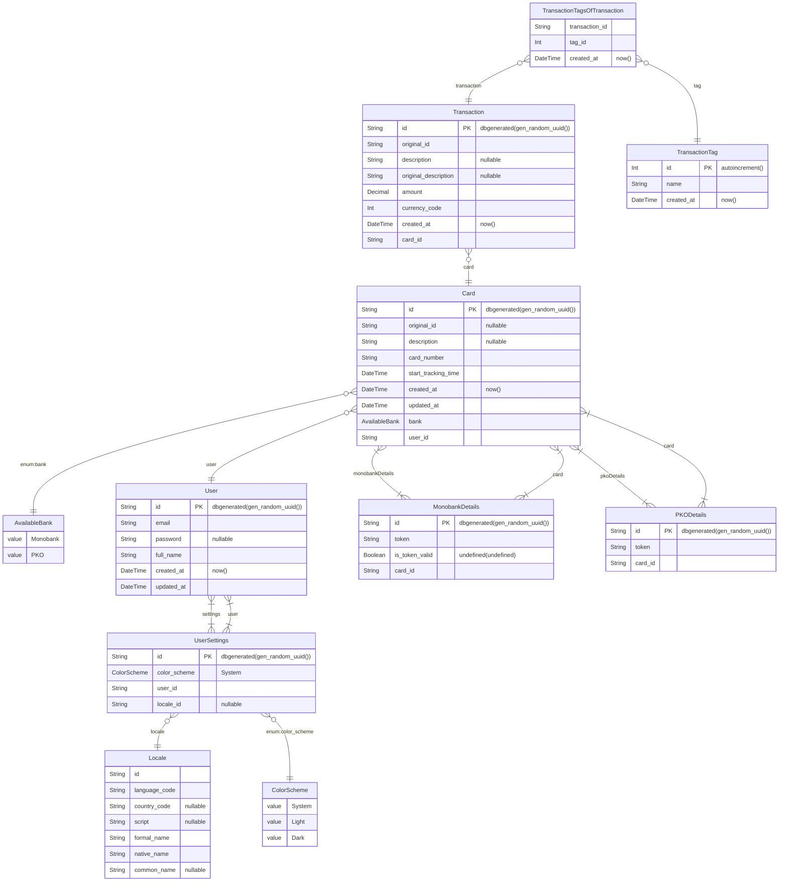

```mermaid
erDiagram
	ColorScheme {
		value System
		value Light
		value Dark
	}
	AvailableBank {
		value Monobank
		value PKO
	}
	User {
		String id PK  "dbgenerated(gen_random_uuid())"
		String email
		String password  "nullable"
		String full_name
		DateTime created_at  "now()"
		DateTime updated_at
	}
	UserSettings {
		String id PK  "dbgenerated(gen_random_uuid())"
		ColorScheme color_scheme "System"
		String user_id
		String locale_id  "nullable"
	}
	Locale {
		String id
		String language_code
		String country_code  "nullable"
		String script  "nullable"
		String formal_name
		String native_name
		String common_name  "nullable"
	}
	Card {
		String id PK  "dbgenerated(gen_random_uuid())"
		String original_id  "nullable"
		String description  "nullable"
		String card_number
		DateTime start_tracking_time
		DateTime created_at  "now()"
		DateTime updated_at
		AvailableBank bank
		String user_id
	}
	MonobankDetails {
		String id PK  "dbgenerated(gen_random_uuid())"
		String token
		Boolean is_token_valid  "undefined(undefined)"
		String card_id
	}
	PKODetails {
		String id PK  "dbgenerated(gen_random_uuid())"
		String token
		String card_id
	}
	Transaction {
		String id PK  "dbgenerated(gen_random_uuid())"
		String original_id
		String description  "nullable"
		String original_description  "nullable"
		Decimal amount
		Int currency_code
		DateTime created_at  "now()"
		String card_id
	}
	TransactionTag {
		Int id PK  "autoincrement()"
		String name
		DateTime created_at  "now()"
	}
	TransactionTagsOfTransaction {
		String transaction_id
		Int tag_id
		DateTime created_at  "now()"
	}
	User }|--|{ UserSettings : settings
	UserSettings }|--|{ User : user
	UserSettings }o--|| Locale : locale
	UserSettings }o--|| ColorScheme : "enum:color_scheme"
	Card }|--|{ MonobankDetails : monobankDetails
	Card }|--|{ PKODetails : pkoDetails
	Card }o--|| User : user
	Card }o--|| AvailableBank : "enum:bank"
	MonobankDetails }|--|{ Card : card
	PKODetails }|--|{ Card : card
	Transaction }o--|| Card : card
	TransactionTagsOfTransaction }o--|| Transaction : transaction
	TransactionTagsOfTransaction }o--|| TransactionTag : tag

```
