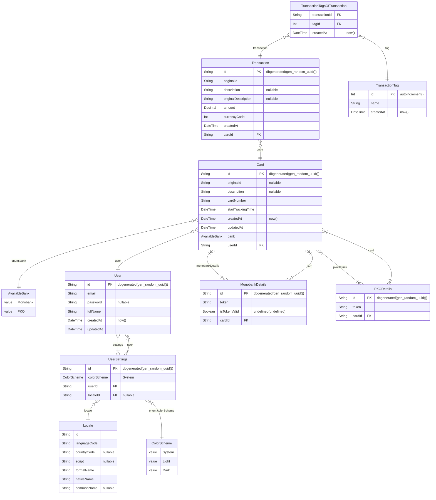

```mermaid
erDiagram
	ColorScheme {
		value System
		value Light
		value Dark
	}
	AvailableBank {
		value Monobank
		value PKO
	}
	User {
		String id PK  "dbgenerated(gen_random_uuid())"
		String email
		String password  "nullable"
		String fullName
		DateTime createdAt  "now()"
		DateTime updatedAt
	}
	UserSettings {
		String id PK  "dbgenerated(gen_random_uuid())"
		ColorScheme colorScheme "System"
		String userId FK
		String localeId FK  "nullable"
	}
	Locale {
		String id
		String languageCode
		String countryCode  "nullable"
		String script  "nullable"
		String formalName
		String nativeName
		String commonName  "nullable"
	}
	Card {
		String id PK  "dbgenerated(gen_random_uuid())"
		String originalId  "nullable"
		String description  "nullable"
		String cardNumber
		DateTime startTrackingTime
		DateTime createdAt  "now()"
		DateTime updatedAt
		AvailableBank bank
		String userId FK
	}
	MonobankDetails {
		String id PK  "dbgenerated(gen_random_uuid())"
		String token
		Boolean isTokenValid  "undefined(undefined)"
		String cardId FK
	}
	PKODetails {
		String id PK  "dbgenerated(gen_random_uuid())"
		String token
		String cardId FK
	}
	Transaction {
		String id PK  "dbgenerated(gen_random_uuid())"
		String originalId
		String description  "nullable"
		String originalDescription  "nullable"
		Decimal amount
		Int currencyCode
		DateTime createdAt
		String cardId FK
	}
	TransactionTag {
		Int id PK  "autoincrement()"
		String name
		DateTime createdAt  "now()"
	}
	TransactionTagsOfTransaction {
		String transactionId FK
		Int tagId FK
		DateTime createdAt  "now()"
	}
	User }|--|{ UserSettings : settings
	UserSettings }|--|{ User : user
	UserSettings }o--|| Locale : locale
	UserSettings }o--|| ColorScheme : "enum:colorScheme"
	Card }|--|{ MonobankDetails : monobankDetails
	Card }|--|{ PKODetails : pkoDetails
	Card }o--|| User : user
	Card }o--|| AvailableBank : "enum:bank"
	MonobankDetails }|--|{ Card : card
	PKODetails }|--|{ Card : card
	Transaction }o--|| Card : card
	TransactionTagsOfTransaction }o--|| Transaction : transaction
	TransactionTagsOfTransaction }o--|| TransactionTag : tag

```
