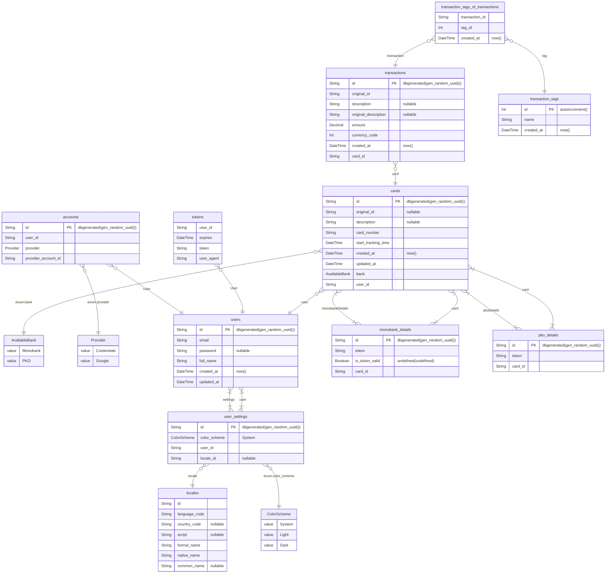

```mermaid
erDiagram
	ColorScheme {
		value System
		value Light
		value Dark
	}
	AvailableBank {
		value Monobank
		value PKO
	}
	Provider {
		value Credentials
		value Google
	}
	users {
		String id PK  "dbgenerated(gen_random_uuid())"
		String email
		String password  "nullable"
		String full_name
		DateTime created_at  "now()"
		DateTime updated_at
	}
	accounts {
		String id PK  "dbgenerated(gen_random_uuid())"
		String user_id
		Provider provider
		String provider_account_id
	}
	tokens {
		String user_id
		DateTime expires
		String token
		String user_agent
	}
	user_settings {
		String id PK  "dbgenerated(gen_random_uuid())"
		ColorScheme color_scheme "System"
		String user_id
		String locale_id  "nullable"
	}
	locales {
		String id
		String language_code
		String country_code  "nullable"
		String script  "nullable"
		String formal_name
		String native_name
		String common_name  "nullable"
	}
	cards {
		String id PK  "dbgenerated(gen_random_uuid())"
		String original_id  "nullable"
		String description  "nullable"
		String card_number
		DateTime start_tracking_time
		DateTime created_at  "now()"
		DateTime updated_at
		AvailableBank bank
		String user_id
	}
	monobank_details {
		String id PK  "dbgenerated(gen_random_uuid())"
		String token
		Boolean is_token_valid  "undefined(undefined)"
		String card_id
	}
	pko_details {
		String id PK  "dbgenerated(gen_random_uuid())"
		String token
		String card_id
	}
	transactions {
		String id PK  "dbgenerated(gen_random_uuid())"
		String original_id
		String description  "nullable"
		String original_description  "nullable"
		Decimal amount
		Int currency_code
		DateTime created_at  "now()"
		String card_id
	}
	transaction_tags {
		Int id PK  "autoincrement()"
		String name
		DateTime created_at  "now()"
	}
	transaction_tags_of_transactions {
		String transaction_id
		Int tag_id
		DateTime created_at  "now()"
	}
	users }|--|{ user_settings : settings
	accounts }o--|| users : User
	accounts }o--|| Provider : "enum:provider"
	tokens }o--|| users : User
	user_settings }|--|{ users : user
	user_settings }o--|| locales : locale
	user_settings }o--|| ColorScheme : "enum:color_scheme"
	cards }|--|{ monobank_details : monobankDetails
	cards }|--|{ pko_details : pkoDetails
	cards }o--|| users : user
	cards }o--|| AvailableBank : "enum:bank"
	monobank_details }|--|{ cards : card
	pko_details }|--|{ cards : card
	transactions }o--|| cards : card
	transaction_tags_of_transactions }o--|| transactions : transaction
	transaction_tags_of_transactions }o--|| transaction_tags : tag

```
